layout: true
  
<div class="my-footer"><span>


<a href="https://www.meetup.com/pt-BR/R-Ladies-Sao-Paulo">Meetup</a> |
<a href="https://twitter.com/RLadiesSaoPaulo">Twitter</a> | 
<a href="http://instagram.com/RLadiesSaoPaulo">Instagram</a> |
<a href="http://facebook.com/RLadiesSaoPaulo">Facebook</a> |
<a href="https://github.com/rladies/meetup-presentations_sao-paulo">GitHub</a> |
<a href="http://bit.ly/2020-2-rladies">bit.ly/2020-2-rladies</a>


</span></div> 
---
class:

```{r setup, include=FALSE}
options(htmltools.dir.version = FALSE)

knitr::opts_chunk$set(fig.align = "center", message=FALSE, warning=FALSE)

library(tidyverse)

```

# Pré-requisitos

## - `R` e `RStudio` instalados no seu notebook 

```{r, echo=FALSE, out.width="40%"}
knitr::include_graphics("img/rlogos/rstudio-r.jpg")
```

## <center><b>OU</b></center> 

## - `RStudio` Cloud

- Através do link: [https://rstudio.cloud/project/876850](https://rstudio.cloud/project/876850)


```{r, echo=FALSE, out.width="40%"}
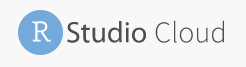
```


---
class:

# Usando a `RStudio` Cloud
- Exemplo de como acessar o projeto (GIF):

```{r, echo=FALSE, out.width="100%"}
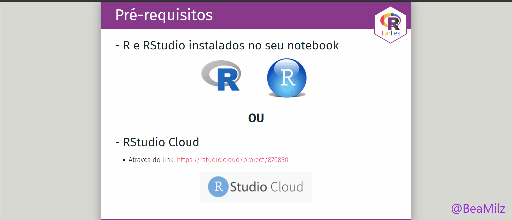
```


- Importante: Quando aparecer na sua tela, clique em **"Save a permanent copy"**.
---
class:

# Programação

## Manhã
- O que é um algoritmo?

- O que é o R?

- Introdução ao RStudio

- Boas Práticas de Programação

- Fundamentos de R

---
class:

# Programação

## Tarde
- Introdução ao Pacote Tidyverse

- O Operador Pipe

- Visualização de Data Frames no RStudio

- Introdução ao Pacote dplyr

- Para aprender mais

---
class:  center

# Apoio

<BR>
```{r echo=FALSE, fig.cap="<center><b>Insper</center></b>", out.width="30%"}
knitr::include_graphics("img/rlogos/Insper-positivo.png")
```

<BR>
```{r, echo=FALSE, out.width="20%", fig.cap="<center><b>RConsortium</center></b>"}
knitr::include_graphics("img/rlogos/RCONSORTIUM.png")
```


---
class:  

# Apoio

<BR>
```{r echo=FALSE, fig.cap="<center><b>Curso-R - www.curso-r.com</center></b>", out.width="30%"}
knitr::include_graphics("img/rlogos/cursor1-41.png")
```

- Ao final do dia: sorteio de uma vaga no curso ["R para Ciência de Dados I"](https://www.curso-r.com/cursos/r4ds-1/).

- **Bolsas de diversidade:** Para inscrição no processo de seleção, é preciso preencher o formulário.

  - **Workshops:** regressão linear, webscraping I , webscraping II, deploy, e XGBOOST
http://bit.ly/curso-r-bolsa-w

  - **Cursos:** R para Ciência de Dados I, R para Ciência de Dados II, Introdução a Machine Learning com R, Dashboards com R e Deep learning com R <br> http://bit.ly/curso-r-bolsa-c
---
class:   

## O que é o R-Ladies?

R-Ladies é uma organização mundial que promove a diversidade de gênero na comunidade da linguagem R.
R-Ladies São Paulo integra, orgulhosamente, a organização R-Ladies Global, em São Paulo.

## Como?

Através de meetups e mentorias em um ambiente seguro e amigável.

Nosso principal objetivo é promover a linguagem computacional estatística `R` compartilhando conhecimento, assim, quem tiver interesse na linguagem será bem-vinda, independente do nível de conhecimento. 


Fonte: [About us - R-Ladies](https://rladies.org/about-us/), [Meetup R-Ladies São Paulo](https://www.meetup.com/R-Ladies-Sao-Paulo/)


---
class:   

## Para quem?

Nosso principal público-alvo são as pessoas que se identificam com o gênero feminino, portanto, mulheres cis, mulheres trans, bem como pessoas não-binárias e queer.

## Missão

Como uma iniciativa de diversidade, a missão das R-Ladies é alcançar uma representação proporcional de pessoas de gêneros atualmente sub-representados na comunidade R, incentivando, inspirando e capacitando-as.

Fonte: [About us - R-Ladies](https://rladies.org/about-us/), [Meetup R-Ladies São Paulo](https://www.meetup.com/R-Ladies-Sao-Paulo/)

---
class:    

## Como o R-Ladies começou?
```{r echo=FALSE, fig.align='center', out.width="20%"}
knitr::include_graphics("https://raw.githubusercontent.com/beatrizmilz/IV-SER-RLadies/master/docs/img/gabriela.jpeg")
```


**[Gabriela de Queiroz](https://github.com/gdequeiroz)** fundou o R-Ladies no dia **1 de outubro de 2012**. Ela queria retribuir à comunidade depois de ir à vários encontros e aprender muito de graça. O primeiro encontro R-Ladies foi realizado em ** San Francisco, Califórnia (Estados Unidos) **. Nos anos seguintes, mais capítulos do R-Ladies começaram em todo o mundo.

Fonte: [About us - R-Ladies](https://rladies.org/about-us/history/)

---
class:    

## Crescimento da R-Ladies no mundo

```{r echo=FALSE, fig.align='center', out.width="70%"}
knitr::include_graphics("img/echarts.png")
```

Atualizado em: Janeiro/2020. Fonte: [R Community Explorer](https://benubah.github.io/r-community-explorer/rladies.html) 
---
class: 

## Comunidade da R-Ladies - Capítulos no mundo
```{r echo=FALSE, out.width="100%"}
knitr::include_graphics("img/r-ladies-community.PNG")
```

Atualizado em: Janeiro/2020. Fonte: [R Community Explorer](https://benubah.github.io/r-community-explorer/rladies.html) 

---
class:    

## Código de conduta
O R-Ladies dedica-se a proporcionar uma experiência livre de assédio para todas as pessoas participantes, desta forma, não é tolerada nenhuma forma de assédio.
[Código de conduta - R-Ladies](https://github.com/rladies/starter-kit/wiki/Code-of-Conduct#portuguese)


---
class:    

# R-Ladies no Brasil
```{r eval=FALSE, include=FALSE}
url <- "https://benubah.github.io/r-community-explorer/data/rladies.csv"
download.file(url, "data/rladies.csv", method = "curl")
```

```{r echo=FALSE, }
rladies <- readr::read_csv("data/rladies.csv")
```


Atualizado em: `r  format(Sys.time(), '%B de %Y')`. Fonte: [R Community Explorer](https://benubah.github.io/r-community-explorer/rladies.html) 

```{r echo=FALSE}
rladies %>% 
  dplyr::arrange(desc(members)) %>%
  filter(country == "Brazil") %>%
  select(-X1,-city,-region,-fullurl,-country, -created) %>%
    DT::datatable(autoHideNavigation = TRUE
                  ,
                options = list(pageLength = 7)
                )
```

---
class:    

# Cronograma da manhã

- O que é um algoritmo?

- O que é o R?

- Introdução ao RStudio

- Boas Práticas de Programação

- Fundamentos de R

---
class:    


# O que é um algoritmo?

Um algoritmo é uma sequência finita de instruções.

**Exemplo**

* Receita de bolo

```{r echo=FALSE, fig.align='center', out.width="90%"}
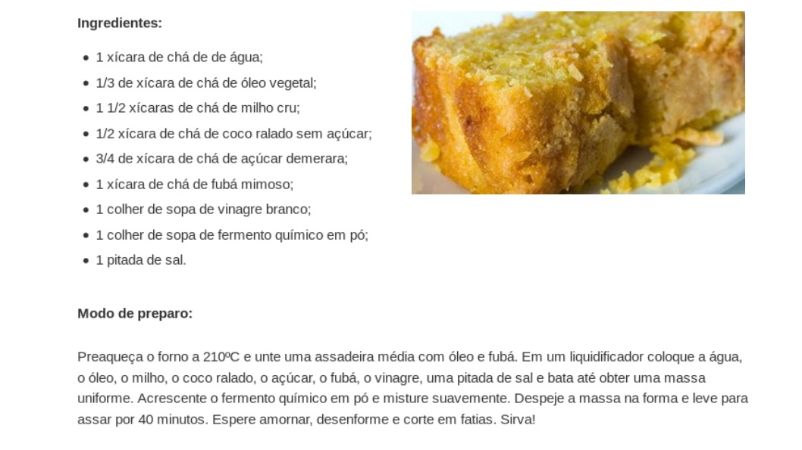
```

---
class:    


# O que é um algoritmo?

Um algoritmo é uma sequência finita de instruções.

**Mais exemplos**

* [Construir uma estante de livros](https://pt.wikihow.com/Construir-uma-Estante-de-Livros)

```{r echo=FALSE, fig.align='center', out.width="70%"}
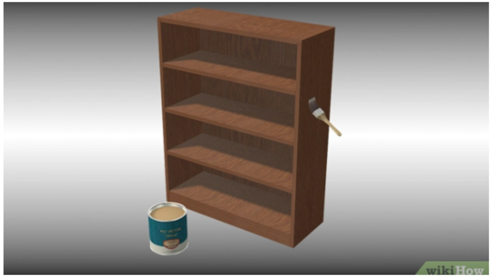
```

---
class:    


# O que é um algoritmo?

Um algoritmo é uma sequência finita de instruções.

**Mais exemplos**

* [Fazer um drone caseiro com arduino](https://www.palpitedigital.com/como-fazer-drone-caseiro-arduino/)

```{r echo=FALSE, fig.align='center', out.width="50%"}
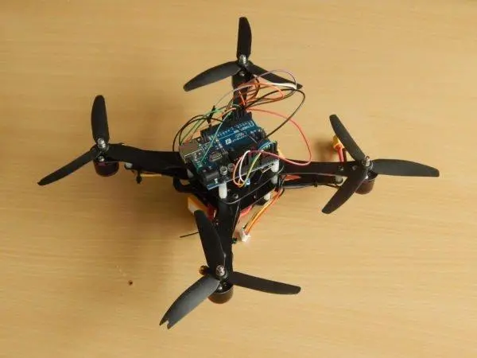
```

---
class:


# O primeiro algoritmo

Foi desenvolvido no século XIX pela matemática e escritora inglesa Ada Lovelace.
 
```{r echo=FALSE, fig.align='center', out.width="40%"}

``` 
---
class:    


# O que é programar? 

Programar um computador é escrever instruções em qualquer **linguagem** que o computador entenda.

Essa sequência de instruções pode ser executada por um humano ou um computador. Então, **programação é a arte de fazer com que o computador execute uma sequência de instruções definidas.**

```{r}
print('Ola!')

```


---
class:    

# O que é o R?
> "R é um ambiente de software livre para computação estatística e gráficos". (https://www.r-project.org/)

**R** é um ambiente computacional e uma linguagem de programação que vem progressivamente se especializando em manipulação, análise e visualização gráfica de dados. Na atualidade é considerado o melhor ambiente computacional para essa finalidade. O ambiente está disponível para diferentes sistemas operacionais: Unix/Linux, Mac e Windows. 

* Baseada na linguagem estatística S   

* 1ª versão de 1995 por Ross Ihaka e Robert Gentleman da Universidade de Auckland

```{r echo=FALSE, out.width="20%"}
knitr::include_graphics("img/Rlogo.png")
```

---
class:    


# O que é o R?
* Berço na Estatística

* Muito usado por cientistas de dados, estatísticos e pesquisadores.

* Mantida pela [R Development Core Team](https://cran.r-project.org/) 

* Pode ser usada para diversos fins.

---
class:    

# Por que usar o R?

- É uma linguagem de programação para análise de dados

- É open source

- É uma linguagem interpretada

- Possui uma comunidade ativa de desenvolvedores

- É flexível, permitindo desenvolver funções e pacotes para facilitar o trabalho 

- Está disponível em diferentes plataformas: Windows, Linux e Mac

- É reprodutível!

- É compartilhável!


---
class:    

# O que é possível fazer com R?

* Análise de dados - Estatística, modelagem, etc.

* Visualização de dados

* Apresentações 

* Relatórios dinâmicos

* Escrever livros 

* Mineração de dados

* Muito mais ...

---
class:    

# Exemplo
**Gráfico elaborado com `R` - Proposta Orçamentária PMSP 2019 - 10 maiores orçamentos** 

```{r echo=FALSE, out.width="70%"}
knitr::include_graphics("img/PMSP-chunk-5-1.png") 
```
Fonte: [Explorando o orçamento da Prefeitura Municipal de São Paulo](https://beatrizmilz.github.io/DadosExecucaoOrcamentariaPMSP/proposta2019.html)


---
class:    


# Exemplo
**Gráfico elaborado com `R` - Execução Orçamentária PMSP na função Gestão Ambiental** 

```{r echo=FALSE, out.width="70%"}
knitr::include_graphics("img/PMSP-chunk-5-2.png") 
```
Fonte: [Explorando o orçamento da Prefeitura Municipal de São Paulo](https://beatrizmilz.github.io/DadosExecucaoOrcamentariaPMSP/gestaoambiental.html)


---
class:    


# Exemplo
**Gráfico elaborado com `R` - Material Particulado 10 - Dados CETESB - RPollution** 

```{r echo=FALSE, out.width="70%"}
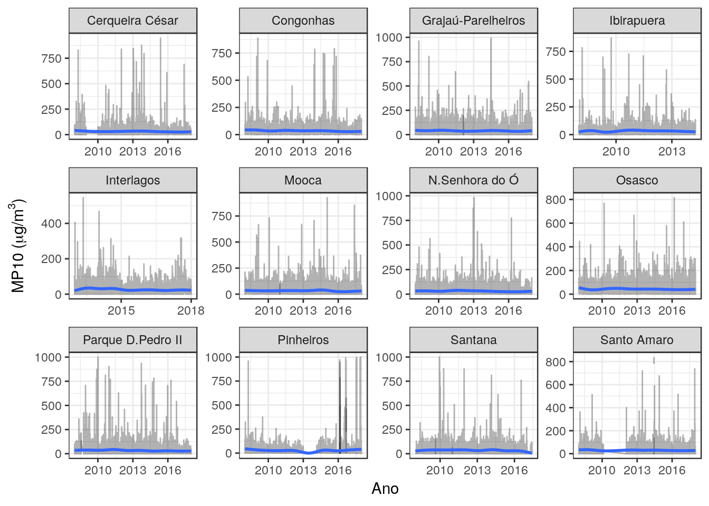 
```
Fonte: [Rpollution](https://www.rpollution.com/)

---
class:    

# Exemplo

**Frequência de Palavras - TESE Doutorado PROCAM/USP Ana Lucia Spinola** 

```{r echo=FALSE, out.width="70%"}
knitr::include_graphics("img/ana-lu-freq.png") 
```
Fonte: [Ana Lu Spinola](https://analuspi.github.io/Text-Mining/)
---
class:    


# Exemplo
**BIGRAM - TESE Doutorado PROCAM/USP Ana Lucia Spinola** 

```{r echo=FALSE, out.width="70%"}
knitr::include_graphics("img/bigram-ana-lu.png") 
```
Fonte: [Ana Lu Spinola](https://analuspi.github.io/Text-Mining/)

---
class: center, middle

## Introdução ao RStudio

---
class:    


# RStudio

**RStudio** é o IDE (integrated development environment) da Linguagem R, ou seja, o ambiente que utilizamos para editar e executar os códigos em R. Tem quatro áreas, conforme a figura abaixo:

```{r echo=FALSE, out.width="80%"}
knitr::include_graphics("img/RStudio_screen.png")
```
Fonte: [Curso Introdução ao `R` - Fatec](https://github.com/MaryMS/2018-11-R-Course-FatecZS)

---
class:    


# RStudio
```{r echo=FALSE, out.width="100%"}
knitr::include_graphics("img/01-rstudio.png")
```
Fonte: [SW Carpentry](http://swcarpentry.github.io/r-novice-gapminder/01-rstudio-intro/index.html)

---
class:    


# RStudio
```{r echo=FALSE, out.width="100%"}
knitr::include_graphics("img/01-rstudio-script.png")
```
Fonte: [SW Carpentry](http://swcarpentry.github.io/r-novice-gapminder/01-rstudio-intro/index.html)


---
class:    


# RStudio
```{r echo=FALSE, out.width="100%"}
knitr::include_graphics("img/haydee1.jpg")
```
Fonte: [Haydee Svab](https://www.slideshare.net/mobile/haydeesvab/anlise-crtica-de-dados-primeiros-passos-com-r)

---
class:    


# RStudio
```{r echo=FALSE, out.width="100%"}
knitr::include_graphics("img/haydee2.jpg")
```
Fonte: [Haydee Svab](https://www.slideshare.net/mobile/haydeesvab/anlise-crtica-de-dados-primeiros-passos-com-r)

---
class:    


# RStudio
```{r echo=FALSE, out.width="100%"}
knitr::include_graphics("img/haydee3.jpg")
```
Fonte: [Haydee Svab](https://www.slideshare.net/mobile/haydeesvab/anlise-crtica-de-dados-primeiros-passos-com-r)

---
class:    


# RStudio
```{r echo=FALSE, out.width="100%"}
knitr::include_graphics("img/haydee4.jpg")
```
Fonte: [Haydee Svab](https://www.slideshare.net/mobile/haydeesvab/anlise-crtica-de-dados-primeiros-passos-com-r)

---
class:    


# RStudio
```{r echo=FALSE, out.width="100%"}
knitr::include_graphics("img/haydee5.jpg")
```
Fonte: [Haydee Svab](https://www.slideshare.net/mobile/haydeesvab/anlise-crtica-de-dados-primeiros-passos-com-r)

---
class:    

# RStudio
```{r echo=FALSE, out.width="100%"}
knitr::include_graphics("img/haydee6.jpg")
```
Fonte: [Haydee Svab](https://www.slideshare.net/mobile/haydeesvab/anlise-crtica-de-dados-primeiros-passos-com-r)

---
class:    


# RStudio
```{r echo=FALSE, out.width="100%"}
knitr::include_graphics("img/haydee7.jpg")
```
Fonte: [Haydee Svab](https://www.slideshare.net/mobile/haydeesvab/anlise-crtica-de-dados-primeiros-passos-com-r)

---
class:    

# RStudio
  


```{r echo=FALSE, out.width="100%"}
knitr::include_graphics("img/haydee8.jpg")
```
Fonte: [Haydee Svab](https://www.slideshare.net/mobile/haydeesvab/anlise-crtica-de-dados-primeiros-passos-com-r)


---
class:    


# Help!

- Pedir ajuda: **help**(nome_da_funcao) ou **?**nome_da_funcao.

```{r, eval=FALSE}
help(sum)
?sum
```

- Se a dúvida permanecer, procure no [Stack OverFlow](https://stackoverflow.com/) ou Google.
- E se ainda tiver dúvidas, pergunte para a comunidade (há grupos no Telegram e outras redes sociais).

---
class: center, middle

## Boas práticas iniciais para organizar seu projeto


Fonte: [SW Carpentry](http://swcarpentry.github.io/r-novice-gapminder/02-project-intro/index.html)

---
class: 

# Boas práticas 

- **Tratar dados como somente leitura:** 

- Esse é provavelmente o objetivo mais importante da configuração de um projeto. 
- Os dados geralmente consomem tempo e/ou são caros para coletar. 

- Trabalhar com eles interativamente (por exemplo, no Excel), onde eles podem ser modificados, significa que você nunca tem certeza de onde os dados vieram, ou como eles foram modificados desde a coleta. 

- Portanto, é uma boa ideia tratar seus dados como “somente leitura”.

- Nunca sobrescrever os seus dados originais! Isso vale para a base e para variáveis.

- Ex: ter uma pasta "data_raw" (dados brutos), e "data" (dados já tratados). 

- Exemplo dos dados de orçamento da prefeitura: com código, fazer download dos dados brutos em uma pasta "data_raw". Tratar os dados, e a base "limpa" deve ser exportada para a pasta "data". Tudo isso deve ser realizado através de código! 


---
class: 

# Boas práticas 

- **Qualquer coisa gerada pelos seus scripts deve ser tratada como descartável:** 


- Não salvar o workspace ao fechar!

- Ideal é que todos os seus resultados sejam possíveis de ser reproduzidos através do script. 


---
class: 

# Boas práticas 

- **Os nomes das suas variáveis devem fazer sentido:** Ao nomear suas variáveis, dê nomes que tenham significado para seres humanos. Pense que o código que você escreve hoje deve ser claro para você daqui 1 ano e também deve ser claro para algum(a) colega seu(ua).


- **Exemplo positivo**:

```{r include=TRUE, eval = FALSE }
lista_de_mercado <- c("chocolate", "pao", "café")

```


- **Exemplo negativo**:

```{r include=TRUE, eval = FALSE }
lista <- c("chocolate", "pao", "café")
```

---
class: 

# Boas práticas 

- **Comente bem o seu código:** É possível fazer comentários usando o símbolo '#'. É sempre bom explicar o que uma variável armazena, o que uma função faz, porque alguns parâmetros são passados para uma determinada função, qual é o objetivo de um trecho de código, etc.

```{r eval=FALSE, include=TRUE}
# Esse é um exemplo. O # é útil para escrever um comentário!

help(sum) # a função help é útil para pesquisar a documentação 
```

- Atalho útil para comentário: `Ctrl + Shift + C`

```{r, echo=FALSE, out.width="100%"}
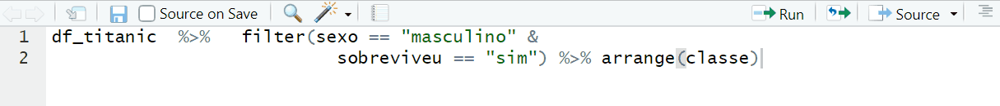
```


---
class: 

# Boas práticas

- **Evite linhas de código muito longas:** Usar linhas de código mais curtas ajuda na leitura do código.

- **Exemplo positivo**:  fica mais fácil de ler!
```{r include=FALSE}
df_titanic <- read_csv("data/titanic.csv")
```

```{r eval=FALSE, include=TRUE}
df_titanic  %>%
  filter(sexo == "masculino" & sobreviveu == "sim") %>%
  arrange(classe)
```

- **Exemplo para evitar:**  fica mais difícil de ler
```{r eval=FALSE, include=TRUE}
df_titanic  %>%   filter(sexo == "masculino" & sobreviveu == "sim") %>%   arrange(classe)
```

- Atalho útil para identação: `Ctrl + Shift + A`

```{r, echo=FALSE, out.width="100%"}
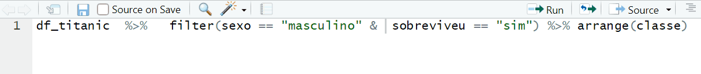
```

Fonte: [SW Carpentry](http://swcarpentry.github.io/r-novice-gapminder/02-project-intro/index.html)

---
class: 

# Boas práticas 

- **Escreva um código organizado:** Por exemplo, adote um padrão no uso de minúsculas e maiúsculas, uma lógica única na organização de pastas e arquivos, pode ser adotada uma breve descrição (como comentário) indicando o que um determinado script faz.

- Exemplo: use snake_case (palavras em minúsculas, separados por um underscore) em todas as variáveis e funções do seu projeto.

- Dica útil: função `clean_names()` do pacote `janitor`.


```{r}
names(iris)
iris_clean <- janitor::clean_names(iris)
names(iris_clean)
```


---
class: 

# Boas práticas 
- **Carregue todos os pacotes que irá usar sempre no início do arquivo:** Quando alguém abrir o seu código será fácil identificar quais são os pacotes que devem ser instalados e quais dependências podem existir.

- Exemplo:

```{r, eval=FALSE, include=TRUE}
# Pacotes utilizados no projeto
library(dplyr) # utilizada para manipulação dos dados
library(ggplot2) # utilizada para criar gráficos bonitos
library(magrittr) # possibilita usar o pipe %>% 
```

---
class: 

# Boas práticas 
- **Evite referência de caminho que considere seu computador ou usuário:** Faça referência ao caminho do projeto.

- **Exemplo positivo**:

```{r include=TRUE, eval = FALSE }
df_titanic <- read_csv("data/titanic.csv")
```


- **Exemplo negativo**:

```{r include=TRUE, eval = FALSE }
df_titanic <- read_csv("C:\Users\beatr\Documents\GitHub\2020-R-Ladies-SP-Basico\data/titanic.csv")
```


---
class:    


# Antes de começar: o projeto

- Ao realizar um projeto, sempre organizar os arquivos em uma **pasta** que conterá todos os arquivos de seu projeto. 

- Nomear novos arquivos com **nomes descritivos**


```{r echo=FALSE, out.width="50%"}
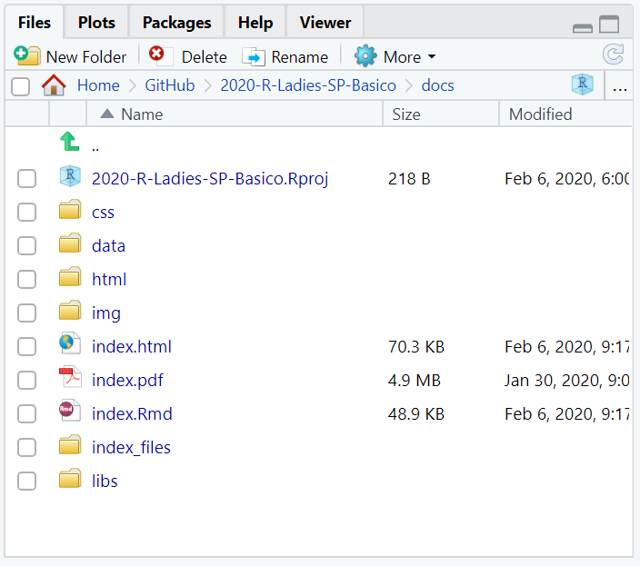 
```

---
class:    


# Projetos

- Um bom layout de projeto facilitará sua vida:

- ajudará a garantir a integridade de seus dados;

- facilita o compartilhamento de seu código com outra pessoa (colega de laboratório, colaborador ou /orientador); 

- ele permite que você facilmente faça o upload do seu código com a submissão do seu manuscrito; torna-se mais fácil recuperar o projeto depois de um intervalo. 


---
class:    


# Criando um projeto


- Clique na opção **“File”** do menu, e então em **“New Project”**. ->  Clique em **“New Directory”**. -> Clique em **“New Project”**. -> 1.  Escreva o nome do diretório (pasta) onde deseja manter seu projeto, ex. “my_project”. Clique no botão **“Create Project”**.

- OBS: Crie um novo script para escrever seus códigos!
  **File -> New File -> RScript **
  
  
```{r echo=FALSE, out.width="90%"}
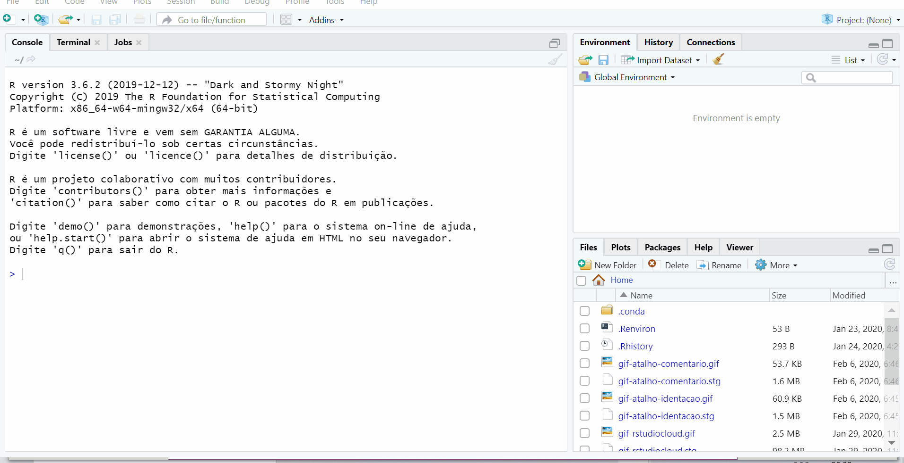 
```


---
class:


# Instruções

- Abrir o `RStudio` no seu computador (ou o RStudio Cloud caso esteja sem RStudio instalado)

- Crie um novo projeto para utilizar durante este curso (caso esteja usando o RStudio Cloud, automaticamente já estará utilizando um projeto) 

- Crie um novo `R` script (file -> new file -> `R` script)

---
class:    


# E lá vamos nós!

<center></center> 

---
class: center, middle

## `R` Básico

---
class:    


# `R` como calculadora

- O `R` permite realizar muitas operações aritméticas em seu console!

```{r}
2 + 5    # adição

9 - 4    # subtração

5 * 2    # multiplicação

7 / 5    # divisão
```


- `CTRL + ENTER`: executa a linha selecionada no script.


---
class:    


# `R` como calculadora

```{r}
9 %% 4   # resto da divisão de 9 por 4

7 %/% 4  # parte inteira da divisão de 7 por 4

8 ^ 2    # potenciação

sqrt(1024) # radiciação
```

A ordem matemática das operações também vale no R.

---
class:    


# Funções matemáticas

```{r}
sin(1)  # funções trigonométricas

log(1)  # logaritmo natural (base e)

log10(10) # logaritmo na base 10

exp(0.5) # e^(1/2)

```

Fonte: [SW Carpentry](http://swcarpentry.github.io/r-novice-gapminder/01-rstudio-intro/index.html)

---
class:    


# Desafio 1

Haydée quer contabilizar quantas pessoas participaram dos meetups das RLadies São Paulo em 2019. Ela contabilizou o número de pessoas que participaram em cada evento: 

1. Fevereiro, Outubro e Novembro - 60 pessoas cada
1. Abril e Agosto - 30 pessoas cada
1. Março, Maio e Julho - 20 pessoas cada 
1. Junho, Setembro e Dezembro - 45 pessoas cada  

Quantas pessoas participaram dos meetups das RLadies em 2019? 

---
class:    


# Desafio 1 - Resposta

Haydée quer contabilizar quantas pessoas participaram dos meetups das RLadies São Paulo em 2019. Ela contabilizou o número de pessoas que participaram em cada evento:

1. Fevereiro, Outubro e Novembro - 60 pessoas cada
1. Abril e Agosto - 30 pessoas cada
1. Março, Maio e Julho - 20 pessoas cada 
1. Junho, Setembro e Dezembro - 45 pessoas cada  

Quantas pessoas participaram dos meetups das RLadies em 2019? 

```{r}
3*60 + 2*30 + 3*20 + 3*45
```

---
class:    


# O que é um objeto?
- Ao se desenvolver um projeto, você irá trabalhar com diversos tipos de arquivos, além de informações que serão repetidas ao longo do script.

- Para reutilizar essas informações ao longo do script utilizamos o que chamamos de **objeto**

- Um objeto é um espaço de memória que retém e representa um valor ou expressão

```{r echo=FALSE, fig.align='center', out.width="40%"}

```

---
class:    


# Atribuindo valor a um objeto no R

- Para atribuir um valor a um objeto no R, utilizamos o operador **<-**  <br></br>

- O atalho ALT + **-** gera o operador **<-** <br></br>

- Todas as declarações em `R` onde são criados objetos atribuindo-se valores a elas, têm a mesma forma:  

<center><b>nome_do_objeto <- valor<b></center>

- Atalho: `ALT` + `-`: cria o `<-` sinal de atribuição.


---
class:    

# Exemplos 
## Objetos e atribuição de valores

```{r}
nome_empregado <- "Tom Cruise de Souza e Silva"
nome_empregado
horas_trabalhadas <- 160
horas_trabalhadas
```


---
class:    

# Exemplos 
## Objetos e atribuição de valores

```{r}
salario <- 3984.23
salario
ativo <- TRUE
ativo
```
---
class:    


# Nomes de objetos
- Os nomes devem começar com uma letra. Podem conter letras, números, _ e .<br></br>

- Recomendação do autor do livro `R` For Data Science: **usar_snake_case**, ou seja, palavras escritas em minúsculo separadas pelo underscore (_).<br></br>

- O `R` é *case sensitive*, isto é, faz a diferenciação entre as letras minúsculas e maiúsculas. Portanto, um objeto chamado *teste* é diferente de uma outro objeto chamada *Teste*.

---
class:    


# Desafio 2
1) Crie objetos para os casos abaixo:

- Restaurante com valor Rodízio Japonês
- Conta a pagar com valor 40,50
- Dinheiro na carteira com valor 60

2) Quanto receberei de troco, se eu pagar a conta do restaurante com o dinheiro que tenho na carteira? Use os objetos criados anteriormente. 

---
class:    


# Desafio 2 - Resposta
1) Crie objetos para os casos abaixo: 

```{r}
restaurante <- "Rodizio Japones"
restaurante
conta <- 40.50
conta
dinheiro <- 60
dinheiro

```

---
class:    


# Desafio 2 - Resposta
2) Quanto receberei de troco, se eu pagar a conta do restaurante com o dinheiro que tenho na carteira? Use os objetos criados anteriormente. 

```{r}

dinheiro - conta

```

---
class:    


# Classes Básicas ou Atômicas do R

São os tipos básicos de dados que podem ser representados na linguagem R. É neles que guardamos as informações que necessitamos para um algoritmo.

- **Integer**: números inteiros <br></br>
- **Numeric**: números racionais <br></br>
- **Complex**: números complexos (raramente usados para Análise de Dados) <br></br>
- **Logical**: TRUE, FALSE ou NA <br></br>
- **Factor**: variavéis categóricas <br></br>
- **Character**: texto <br></br>

---
class:    


# Exemplos: integer

```{r}
10L # Um número inteiro pode ser representado acompanhado de um L
2019L
```

---
class:    


# Exemplos: numeric

```{r}
10
2019
5.44
```

---
class:    


# Exemplos: complex
```{r}
4 + 9i
```

---
class:    


# Exemplos: logical
```{r}
TRUE
FALSE
```

---
class:    


# Exemplos: factor

```{r}
escolaridade <- c("Médio", "Superior", "Fundamental", "Fundamental", "Médio")
fator <- as.factor(escolaridade)
fator
```

A função as.factor() criou um objeto do tipo factor.

Na linha *Levels* aparecem os rótulos do fator.

Essa classe de dados pode ser trabalhada com o pacote **forcats**.

---
class:    


# Exemplos: character

```{r}
"escola"
"2019"
"I love pinschers."
```

---
class:    


# Operações simples com strings

```{r}
animal <- "Camaleao"
#letras maiúsculas
toupper(animal)
#letras minúsculas
tolower(animal)
#número de caracteres
nchar(animal)
```

---
class:    


# Função class

A função **class** mostra a classe de um objeto.

```{r}
nome_filme <- "Bohemian Rhapsody"
class(nome_filme)
ano_inteiro <- 2018L
class(ano_inteiro)
ano <- 2018
class(ano)
```

---
class:    


# Função class

```{r}
motor <- 1.5
class(motor)
passou_enem <- TRUE
class(passou_enem)
```

---
class:    


# Conversão de classes

Podemos forçar um objeto a ser de uma classe específica com as funções:  
- as.character() <br></br>
- as.numeric() <br></br>
- as.integer() <br></br>
- as.logical() <br></br>

---
class:    


# Conversão de classes
** Exemplos de conversão de classes **

```{r}
vetor <- 0:9
vetor
class(vetor)

vetor_numeric <- as.numeric(vetor)
vetor_numeric
class(vetor_numeric)
```

---
class:    


# Conversão de classes
** Exemplos de conversão de classes **


```{r}
vetor_logical <- as.logical(vetor)
vetor_logical
class(vetor_logical)
```

---
class:    


# Desafio 3

Converta o objeto Conta criado anteriormente para character. Agora cheque sua classe. O que acontece com seu valor? Como explica o que aconteceu?

---
class:    


# Desafio 3 - Resposta

Converta o objeto Conta criado anteriormente para character. Agora cheque sua classe. O que acontece com seu valor? 

```{r}
conta
```

```{r}
as.character(conta)
```

---
class:    


# Desafio 3 - Resposta

Converta o objeto Conta criado anteriormente para character. Agora cheque sua classe. O que acontece com seu valor? 

```{r}
conta
class(conta)
```

```{r}
as.character(conta)
```

```{r}
conta <-  as.character(conta)
```

```{r}
class(conta)
```
---
class:    


# Tipos de objetos

Os tipos dos objetos são definidos a partir dos valores armazenados neles:

- **Vector**: armazena elementos de mesma classe. <br></br>   
- **Matrix**: vetores de duas dimensões que armazenam elementos de mesma classe. <br></br>
- **List**: tipo especial de vetor que aceita elementos de classes diferentes. <br></br>
- **Data.frame**: são tabelas de dados com linhas e colunas, como uma tabela do Excel. Como são listas, essas colunas podem ser de classes diferentes.

---
class:    


# Exemplo: Vector

A função c() cria um vetor.
```{r}
semestre1 <- c("janeiro", "fevereiro", "março", "abril", "maio")
notas_alunos <- c(5, 6.5, 10, 0.5, 2.75)
```

É possível realizar operações com vetores.

```{r}
vetor1 <- 1:5
vetor1 / 5   # objeto vetor1 dividido por 5
```

```{r}
vetor2 <- 6:10
vetor1 * vetor2
```

---
class:    


# Exemplo: Matrix

A função matrix() cria uma matriz.
```{r}
primeira_matriz <- matrix(1:8, nrow = 2, ncol = 4)
primeira_matriz
```

A função dim() retorna a dimensăo da variável (linha e coluna).
```{r}
dim(primeira_matriz)
```

---
class:    


# Exemplo: List

A função list() cria uma lista.
```{r}
wizards <- list("Harry Potter", 18, TRUE, c("Hermione Granger", "Rony Weasley"))
class(wizards)
```

A função is.list() verifica se a variável é ou não uma lista.

```{r}
harry_friends <- c("Hermione Granger", "Rony Weasley")
class(harry_friends)
is.list(harry_friends)
```

---
class:    


# Exemplo: Data.frame


A função head() mostra as primeiras 6 linhas do dataframe.
```{r}
data(iris)

df <- iris

head(df)
```

---
class:    


# Funções úteis 

##Para trabalhar com dataframes

- `tail()`: mostra as últimas 6 linhas.

- `names()`: mostra os nomes das colunas.

- `View()`: mostra o dataframe.

---
class:    


# Desafio 4

1) Quantas observações tem o data.frame iris?<br></br>
2) Quais são as variáveis do data.frame iris?<br></br>
3) Visualize o dataframe iris.

---
class:    


# Desafio 4 - Resposta

1) Quantas observações tem o data.frame iris?<br></br>
```{r}
tail(df)
```
2) Quais são as variáveis do data.frame iris?

```{r}
names(df)
```
---
class:    


# Desafio 4 - Resposta

3) Visualize o dataframe iris.
```{r eval=FALSE}
View(df)
```

```{r echo=FALSE, fig.align='center', out.width="75%"}
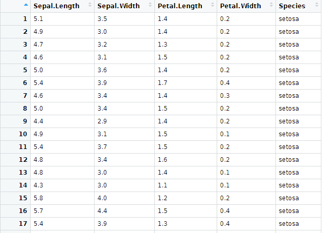
```

---
class:


# Operadores Relacionais
- Igual a: **==** <br></br> 
- Diferente de: **!=** <br></br>
- Maior que: **>** <br></br>
- Maior ou igual: **>=** <br></br>
- Menor que: **<** <br></br>
- Menor ou igual: **<=** <br></br>

---
class:    


# Exemplos de Operadores Relacionais

Igual a: **==**
```{r}
TRUE == TRUE

TRUE == FALSE
```
---
class:    


# Exemplos de Operadores Relacionais

Diferente de **!=**
```{r}
TRUE != TRUE

TRUE != FALSE
```
---
class:

# Exemplos de Operadores Relacionais

Menor de: **<**
```{r}
3 < 5
```

Maior ou igual de: **>=**
```{r}
10 >= 10
```

Maior de: **>=**
```{r}
10 > 10
```

---
class:


# Operadores Lógicos

- E: **&** <br></br>
Será verdadeiro se os dois forem TRUE 

```{r}
x <- 5

 x >= 3 & x <=7
```
```{r}
y <- 2

 y >= 3 & y <= 7
```
---
class:


# Operadores Lógicos

- OU: **|**<br></br>
Será verdadeiro se um dos dois forem TRUE

```{r}
y <- 2

 y >= 3 | y <=7
```

```{r}
y <- 1

 y >= 3 | y == 0
```
---
class:


# Operadores Lógicos

- Negação: **!** <br></br>

```{r}
(!x < 4)
```

---
class:


# NA

Uma característica importante do R que pode dificultar a comparação são os valores ausentes ou **NAs** (não disponíveis). 

**NA** representa um valor desconhecido. 

---
class:


# NA

Quase qualquer operação envolvendo um valor desconhecido também será desconhecido:

```{r}
NA > 10
10 == NA
NA + 10
NA / 2
```

---
class:


# NA

E o mais confuso:

```{r}
NA == NA
```

<br></br>

**is.na()** é a função que testa se uma variável é NA.

---
class:    


# Índices 

- Indicam a posição do elemento na variável.<br><br>
- Inicia-se a contagem do índice pela posição do primeiro elemento da variável, ou seja, pelo número 1.<br><br>

*Vetores*: característica linear

```{r}
v <- c(10:25)

v[2]
```

*Data Frames*: o primeiro número indica a linha (observação) e o segundo a coluna (variável).

```{r}
df[145, 2]
```

---
class:    


# Desafio 5

1) No data.frame iris, testar se o Petal.Lenght da 5ª observação é igual ao da 6ª observação. E se o Petal.Lenght da 5ª observação é igual ao da 7ª observação.<br></br>


2) A 10ª observação tem Petal.Width maior ou menor que a seguinte (11ª)? 
E qual é a espécie da menor?

---
class:    


# Desafio 5 - Resposta

1) No data.frame iris, testar se o Petal.Lenght da 5ª observação é igual ao da 6ª observação. E se o Petal.Lenght da 5ª observação é igual ao da 7ª observação.

```{r}
df[5,3] == df[6,3]
df[5,3] == df[7,3]
```

---
class:    


# Desafio 5 - Resposta

2) A 10ª observação tem Petal.Width maior ou menor que a seguinte (11a)? 
E qual é a espécie da menor?

```{r}
df[10,4] < df[11,4] # Petal.Width da 10ª linha é menor que da 11ª

df[10,5]
```

---
class:    


# Pacotes no R

**Pacotes** são coleções de funções, dados e documentação que estendem as capacidades do `R` básico.

Eles precisam ser instalados e carregados.

<center></center>

---
class:    


## Instalação de Pacotes:

- Via CRAN: install.packages("nome-do-pacote").

```{r, include=TRUE, eval = FALSE }
install.packages("tidyverse")
```

- Via Github: devtools::install_github("nome-do-repo/nome-do-pacote").

```{r, include=TRUE, eval = FALSE }
devtools::install_github("tidyverse/dplyr")
```


## Carregar pacotes:

- library(nome-do-pacote)

```{r, eval=TRUE, message=FALSE}
library(tidyverse)
```

---
class:    


# Dicas sobre Pacotes

1. Você só precisa instalar o pacote uma vez, mas precisa carregá-lo sempre que começar uma nova sessão;

2. Para instalar o pacote use as aspas;  

3. Para carregar o pacote, **não** utilize as aspas.

---
class:    


# Pacotes - CRAN Task View

Relação de pacotes encontrados no CRAN por áreas de interesse.

- [CRAN Task View](https://cran.r-project.org/web/views/)

```{r echo=FALSE, fig.align='center', out.width="100%"}
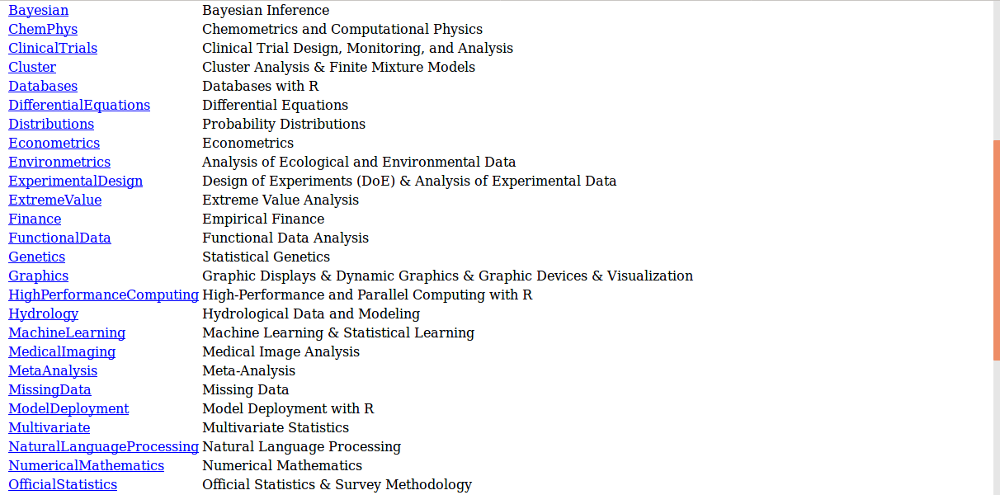
```

---
class:

# Vamos nos preparar para a tarde?

Para quem está usando o RStudio instalado no computador:

- No seu projeto, crie uma pasta chamada `data`

- Fazer o download deste arquivo: [`titanic`](https://raw.githubusercontent.com/beatrizmilz/2020-R-Ladies-SP-Basico/master/docs/data/titanic.csv) ou em [bit.ly/titanic-rladies](http://bit.ly/titanic-rladies)

- Salve este arquivo na pasta `/data`  <br></br>

- Instale o pacote `tidyverse`:


```{r, include=TRUE, eval = FALSE }
install.packages("tidyverse")
```

- OBS: Caso esteja usando RStudio Cloud, não é necessário realizar estes passos, pois já foram feitos anteriormente.
---
class:    

# Cronograma da tarde

- Introdução ao Pacote Tidyverse

- O Operador Pipe

- Visualização de Data Frames no RStudio

- Introdução ao Pacote dplyr

- Para aprender mais


---
class: center, middle

## Tidyverse

---
class:

# O Tidyverse

É uma coleção de pacotes `R` projetados para a ciência de dados. Todos os pacotes compartilham uma mesma filosofia de desenvolvimento, sintaxe e estruturas de dados.

```{r echo=FALSE, fig.align='center', out.width="90%"}
knitr::include_graphics("img/Tidyverse_packages.png")
```

---
class:


# Pacotes do Tidyverse

- **ggplot2**: cria gráficos <br></br>
- **dplyr**: manipulação de dados <br></br>
- **tidyr**: arruma os dados <br></br>
- **readr**: leitura dos dados <br></br>
- **purrr**: ferramentas para programação funcional, trabalha com funções e vetores <br></br>
- **tibble**: dataframes moderno, mais simples de manipular <br></br>
- **magrittr**: facilita a escrita e leitura do código <br></br>
- **stringr**: trabalha com strings <br></br>
- **forcats**: trabalha com fatores <br></br>
- **lubridate**: trabalha com datas


---
class:


# O operador %>%, o Pipe

Imagine uma receita que tenha as instruções: junte os ingredientes, misture e leve ao forno. Na forma usual do R, essas instruções provavelmente seriam assim:


**forno(misture(junte(ingredientes)))**


Dessa forma temos que pensar “de dentro para fora”. O primeiro comando que lemos é forno, sendo que essa é a última operação que será realizada.

Com o operador pipe seria algo assim:


**ingredientes %>% junte %>% misture %>% forno**


É mais intuitivo!
  
---
class:


# O operador %>%, o Pipe

Para ficar mais fácil: pense no Pipe %>% como um operador que efetua as operações à direita nos valores que estão à esquerda.

Ou ainda, o operador %>%  passa o que está à esquerda como argumento para a operação da direita.

**Atalho**: CTRL + SHIFT + M

---
class:    

# Dataframes  - Tidy data

```{r echo=FALSE, out.width="100%"}
knitr::include_graphics("img/tidy-1.png")
```

Fonte: [Data Science with `R` by Garrett Grolemund](http://garrettgman.github.io/tidying/)

---
class:


# Importação de arquivos

Pacote **readr**: funções para ler arquivos texto
- read_csv
- read_csv2
- read_delim
- read_log
- read_rds

Pacote **readxl**: função para ler arquivo Excel  
- read_excel

Pacote **haven**: funções para ler outros softwares estatísticos

- read_sas
- read_spss
- read_stata

---
class:


# E lá vamos nós!

<center></center> 


---
class:


# Importação de arquivos


- Iremos importar a base [`titanic`](https://raw.githubusercontent.com/beatrizmilz/2020-R-Ladies-SP-Basico/master/docs/data/titanic.csv):

```{r, message=FALSE}
library(tidyverse)

# Uma outra opção é carregar somente o(s) pacote(s) que irá utilizar.
library(dplyr)

# Importa o arquivo csv para o objeto df_titanic
df_titanic <- read_csv("data/titanic.csv")

```


---
class:

# Import Dataset - RStudio

## Importar CSV - From Text (readr)
- Exemplo: abrindo uma base csv que já está no computador
```{r, echo=FALSE, out.width="95%"}
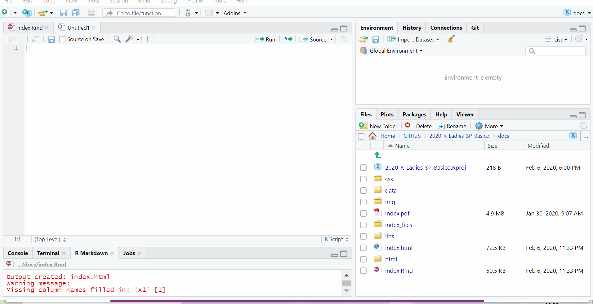
```

---
class:

# Import Dataset - RStudio

## Importar excel - From Excel
- Exemplo: abrindo uma base excel que está online
```{r, echo=FALSE, out.width="95%"}
knitr::include_graphics("img/gif-importarexcel.gif")
```
Site dos dados do exemplo: [Execução orçamentária PMSP](http://orcamento.sf.prefeitura.sp.gov.br/orcamento/execucao.php)
---
class:


# View e glimpse

- Para visualizar um objeto: **View**(nome-do-objeto)

- **glimpse()**: mostra informações como o número de observações (linhas) e variáveis (colunas), o nome das colunas, o tipo delas e os primeiros dados de cada coluna.

```{r}
df_titanic %>% glimpse()
```


---
class:


# dplyr

A ideia do pacote **dplyr** é tornar a manipulação de dados explícita utilizando verbos que indicam a ação a ser realizada. 

O encadeamento dos verbos com o banco de dados é realizado com o operador **pipe**: **%>%**

O dplyr foi desenhado para trabalhar com o operator pipe **%>%** do pacote magritrr.

---
class:

# Os 6 verbos do dplyr 

- **filter**(): seleciona linhas <br></br>
- **arrange**(): ordena de acordo com uma ou mais colunas <br></br>
- **select**(): seleciona colunas <br></br>
- **mutate**(): cria/modifica colunas <br></br>
- **summarise**(): sumariza/agrega colunas <br></br>
- **group_by**(): agrupa colunas


---
class:


# filter

Selecionar linhas da base de dados.

OBS: **Tibble** é uma releitura moderna do data.frame.

```{r}
df_titanic %>% filter(sobreviveu == "sim") # Seleciona os sobreviventes.
```


---
class:


# filter

```{r, message=FALSE}
# Cria um objeto e atribui a ele as linhas com os sobreviventes.
sobreviventes <- df_titanic %>% filter(sobreviveu == "sim")


# Crianças com menos de 12 anos que sobreviveram.
criancas_sobreviventes <- df_titanic %>% filter(sobreviveu == "sim" & idade < 12)


# Embarque realizado nos locais: Southampton ou Queenstow.
embarque <- df_titanic %>% filter(embarque == "Southampton" |
                                  embarque == "Queenstow")
      
                                                                

# A instrução acima pode ser reescrita com o operador %in%:
embarque <- df_titanic %>% filter(embarque %in% c("Southampton", "Queenstow"))

```

---
class:


# filter

```{r, message=FALSE}
# Pessoas sem informação de local de embarque.
# is.na() - função que retorna TRUE se o valor for NA e FALSE se não for.
sem_embarque <- df_titanic %>% filter(is.na(embarque))


# Pessoas que tem "Elizabeth" em qualquer posição do campo nome.
# str_detect - função que retorna TRUE se detectou o valor dado e 
# FALSE, caso não tenha encontrado.
nome <- df_titanic %>% filter(str_detect(nome, "Elizabeth"))
```

---
class:


# Desafio 1

1) Criar um objeto chamado passageiras que seleciona somente as passageiras.

2) Criar um objeto chamado criancas_Cherbourg que seleciona as crianças com menos de 12 anos que embarcaram na cidade de Cherbourg.

---
class:


# Desafio 1 - Resposta

1) Criar um objeto chamado passageiras que seleciona somente as passageiras.

```{r, message=FALSE}
passageiras <- df_titanic %>%  filter(sexo == "feminino")
```

2) Criar um objeto chamado criancas_Cherbourg que seleciona as crianças com menos de 12 anos que embarcaram na cidade de Cherbourg.

```{r, message=FALSE}
criancas_Cherbourg <- df_titanic %>% filter(idade < 12 & embarque == "Cherbourg")
```

---
class:


# arrange

Ordenar as linhas da base de dados conforme uma ou mais variáveis.

```{r}
# Ordena por ordem crescente da coluna nome.
passageiros_ordenados <- df_titanic %>% arrange(nome)
passageiros_ordenados
```

---
class:


# arrange 

É possível ordenar na ordem descrescente e também por mais de uma variável.

```{r}
# Ordena por ordem decrescente de idade e por ordem crescente de nome.
passageiros_ordenados <- df_titanic %>% arrange(desc(idade), nome)
passageiros_ordenados
```
---
class:

#arrange

- É possível também usar outras funções dentro do arrange. como `is.na`

```{r}
# ordenando pelas variáveis que tem muitos campos vazios ou NA 
# (neste caso as variáveis são cabine e idade)
df_titanic %>% arrange(desc(is.na(idade)),
                       desc(cabine == "")) %>% head()
```

---
class:


# filter & arrange

```{r}
# Filtra os sobreviventes homens e ordena por classe.
df_titanic  %>% 
  filter(sexo == "masculino" & sobreviveu == "sim") %>% 
  arrange(classe)
```

---
class:


# Desafio 2

1) Ordenar os passageiros por ordem decrescente de classe e nomeie o objeto.

2) Ordenar somente as passageiras por ordem de idade e dê um nome para o objeto.

---
class:


# Desafio 2 - Resposta

1) Ordenar os passageiros por ordem decrescente de classe e nomeie o objeto.

```{r}
passageiros <- df_titanic %>% arrange(desc(classe))
```

2) Ordenar somente as passageiras por ordem de idade e dê um nome para o objeto.

```{r}
mulheres <- df_titanic %>% 
  filter(sexo == "feminino") %>% 
  arrange(idade)
```

---
class:


# select

Selecionar colunas (variáveis) da base de dados.

```{r}
# Seleciona as colunas indicadas.
df_titanic %>% select(nome, idade, classe, embarque)
```

---
class:


# select

O select tem várias funções úteis, como por exemplo:

- **starts_with**("cla"): seleciona colunas que começam com "cla" <br></br>
- **ends_with**("ifa"): seleciona colunas que terminam com "ifa" <br></br>
- **contains**("ssa"): seleciona colunas que contêm "ssa" <br></br>

---
class:


# select

```{r}
# Seleciona as colunas que começam com "id".
df_titanic %>%  select(starts_with("id"))
```

---
class:


# select

Ao inserir o caracter **-** na frente da coluna, você estará excluindo as colunas da seleção.

```{r}
df_titanic %>%  select(-id_passageiro, -nome)
```

---
class:


# Desafio 3


1) Criar um objeto para salvar o resultado com as colunas nome, tarifa e classe.

2) Mostrar uma tabela com as tarifas maiores que 50 por ordem decrescente de tarifa e ordem crescente de classe. A tabela não deverá conter os campos irmaos_conjuge, pais_criancas e passagem.

---
class:


# Desafio 3 - Resposta

1) Criar um objeto para salvar o resultado com as colunas nome, tarifa e classe.

```{r}
tarifa <- df_titanic %>% select(nome, tarifa, classe)
```


2) Mostrar uma tabela com as tarifas maiores que 50 por ordem decrescente de tarifa e ordem crescente de classe. A tabela não deverá conter os campos irmaos_conjuge, pais_criancas e passagem.

```{r}
tarifa_classe <- df_titanic %>% 
  filter(tarifa > 50) %>% 
  select(-irmaos_conjuge, -starts_with("p")) %>% 
  arrange(desc(tarifa), classe)
```

---
class:


# mutate

Criar ou modificar colunas de uma base de dados.

Supondo que o valor da tarifa no dataset está em libras, e que 1£ = R$ 4.93, vamos descobrir qual é o valor das tarifas em reais.

```{r}
# Altera a coluna tarifa para o valor da tarifa em reais.
tarifa_conversao <- df_titanic %>% mutate(tarifa = tarifa * 4.93)


# Retorna a coluna tarifa para o valor da época.
tarifa_conversao <- df_titanic %>% mutate(tarifa = tarifa / 4.93)
```

---
class:


# mutate

```{r}
# Cria no dataset uma nova variável chamada tarifa_reais.
tarifa_conversao <- df_titanic %>% mutate(tarifa_real = tarifa * 4.93)
tarifa_conversao
```

---
class:


# Desafio 4

Criar uma tabela com um novo campo que contenha a tarifa em dólar seguindo essa cotação: 1£ = $ 1.31.
Classifique por ordem decrescente de tarifa.

---
class:


# Desafio 4 - Resposta

Criar uma tabela com um novo campo que contenha a tarifa em dólar seguindo essa cotação: 1£ = $ 1.31.
Classifique por ordem decrescente de tarifa.

```{r}
tarifa_conversao <- df_titanic %>% 
  mutate(tarifa_dolar = tarifa * 1.31) %>% 
  arrange(desc(tarifa))
```

---
class:


# summarize

Sumariza colunas da base de dados, ou seja, resume os valores das colunas em um só valor,
podendo ser a média, mediana, min, max, etc.

```{r}
# Calcula a média da variável idade
# na.rm = TRUE remove os NAs
df_titanic %>% summarize(mean(idade, na.rm=TRUE))

```

---
class:


# summarize

```{r}
# Calcula: número de mulheres, mediana geral da tarifa e número de passageiros.
# No caso abaixo a função sum() retorna o número de mulheres. 
# A função n() mostra o número de linhas (em cada grupo) e 
# costuma ser bastante usada com o summarize.
df_titanic %>% 
  summarize(
    mulheres = sum(sexo == "feminino", na.rm = TRUE),
    mediana_tarifa = median(tarifa, na.rm = TRUE),
    num_passageiros = n()
)
```

---
class:


# summarize

```{r}
# Filtra os passageiros homens e calcula a mediana da tarifa.
df_titanic %>% 
  filter(sexo == "masculino") %>% 
  summarize(
    mediana_tarifa = median(tarifa, na.rm = TRUE)
)
```

---
class:


# Desafio 5

1) Calcular a média da tarifa.

2) Filtrar as passageiras mulheres e calcular a mediana da tarifa. 

---
class:


# Desafio 5 - Resposta

1) Calcular a média da tarifa.

```{r}
media_tarifa <- df_titanic %>% summarize(mean(tarifa, na.rm=TRUE))
```

2) Filtrar as passageiras mulheres e calcular a mediana da tarifa.

```{r}
mulheres_tarifa <- df_titanic %>% 
  filter(sexo == "feminino") %>% 
  summarize(
    mediana_tarifa = median(tarifa, na.rm = TRUE)
)
```

---
class:


# group_by + summarize

Agrupa as colunas de uma base de dados. 

O group_by é bastante utilizado com o summarize.

```{r}
# Agrupa pela variável sobreviveu e calcula
# o número de passageiros por grupo (sim/nao).
df_titanic %>% 
  group_by(sobreviveu) %>% 
  summarize(num_passageiros = n())
```

---
class:


# group_by + summarize 
  
```{r}
# Agrupa pelo local de embarque e calcula a mediana da tarifa de cada grupo.
df_titanic %>% 
  group_by(embarque) %>% 
  summarize(mediana_tarifa = median(tarifa, na.rm = TRUE))
```

---
class:


# Desafios 6

1) Criar uma tabela com a quantidade de pessoas por classe.

2) Criar uma tabela com a mediana da tarifa por sexo.

---
class:


# Desafio 6 - Resposta

1) Criar uma tabela com a quantidade de pessoas por classe.
  
```{r}
df_titanic %>% 
  group_by(classe) %>% 
  summarize(qtd_classe = n())
```

---
class:


# Desafio 6  - Resposta

2) Criar uma tabela com a mediana da tarifa por sexo.

```{r}
df_titanic %>% 
  group_by(sexo) %>% 
  summarize(mediana_tarifa = median(tarifa, na.rm = TRUE))
```


---
class: middle


<center></center>

---
class:    


# Para aprender mais

- [Repositório RLadies São Paulo](https://github.com/rladies/meetup-presentations_sao-paulo) <br></br>
- [Livro `R` for Data Science](https://r4ds.had.co.nz) <br></br>
- [Software Carpentry](https://software-carpentry.org/lessons/) <br></br>
- [Material do Curso-R](https://www.curso-r.com/material/) <br></br>
- [R-Bloggers](https://www.r-bloggers.com) <br></br>

---
class:    


# Referências

- https://r4ds.had.co.nz

- https://www.curso-r.com/material/

- https://www.tidyverse.org

- https://software-carpentry.org/lessons/

- http://brunaw.com/slides/rladies-sp/13-08-2018/meetup.html#1

- https://github.com/MaryMS/2018-11-R-Course-FatecZS

- https://beatrizmilz.github.io/talk/oficina_intro_r_ufabc_2018/

- https://bookdown.org/wevsena/curso_r_tce/curso_r_tce.html

- https://rstudio-pubs-static.s3.amazonaws.com/279878_c7634fb5fe9e40b7abc7c35aa724a2a0.html


---
class:    


# Referências

- https://analisereal.com/tag/introducao-a-analise-de-dados-com-o-r-2/

- http://r-statistics.co/Top50-Ggplot2-Visualizations-MasterList-R-Code.html


---
class:   

# Como saber mais?
  - Website RLadies Global: [https://rladies.org/](https://rladies.org/)
  - Twitter: [@RLadiesGlobal](https://twitter.com/rladiesglobal), [@RLadiesSaoPaulo](https://twitter.com/RLadiesSaoPaulo)
  - Instagram: [@RLadiesSaoPaulo](http://instagram.com/RLadiesSaoPaulo)
  - Facebook: [@RLadiesSaoPaulo](http://facebook.com/RLadiesSaoPaulo)
  - MeetUp: [https://www.meetup.com/pt-BR/R-Ladies-Sao-Paulo](https://www.meetup.com/pt-BR/R-Ladies-Sao-Paulo)
  - Github: [https://github.com/rladies/meetup-presentations_sao-paulo](https://github.com/rladies/meetup-presentations_sao-paulo)
  - R-Ladies LATAM Blog (Latin America) - Em breve!
### Não tem capítulo na sua cidade e quer iniciar um?
<center> Saiba como em <a href="https://rladies.org/about-us/help/"> R-Ladies - How do get involved </a> </center>


- Apresentação feita com [Xaringan](https://github.com/yihui/xaringan), com o tema `metropolis` modificado por [Bea Milz](https://beatrizmilz.com).
