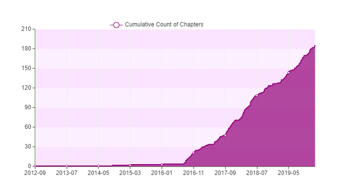

layout: true
  
<div class="my-footer"><span>


<a href="https://www.meetup.com/pt-BR/R-Ladies-Sao-Paulo">Meetup</a> |
<a href="https://twitter.com/RLadiesSaoPaulo">Twitter</a> | 
<a href="http://instagram.com/RLadiesSaoPaulo">Instagram</a> |
<a href="http://facebook.com/RLadiesSaoPaulo">Facebook</a> |
<a href="https://github.com/rladies/meetup-presentations_sao-paulo">Github</a> |
<a href="http://bit.ly/...">bit.ly/...</a>


</span></div> 
---

```{r setup, include=FALSE}
options(htmltools.dir.version = FALSE)

knitr::opts_chunk$set(echo = FALSE, fig.align = "center", message=FALSE, warning=FALSE)

library(tidyverse)

```


# Programação

## Manhã
- ...

- ...

## Tarde
- ...

- ...


---
class:  center

# Apoio

<BR>
```{r, out.width="50%", fig.cap="<center><b>Insper</center></b>"}
#knitr::include_graphics("img/logos/")
```

<BR>
```{r, out.width="25%", fig.cap="<center><b>RConsortium</center></b>"}
knitr::include_graphics("img/rlogos/RCONSORTIUM.png")
```


---
class:   

## O que é o R-Ladies?

R-Ladies é uma organização mundial que promove a diversidade de gênero na comunidade da linguagem R.
R-Ladies São Paulo integra, orgulhosamente, a organização R-Ladies Global, em São Paulo.

## Como?

Através de meetups e mentorias em um ambiente seguro e amigável.

Nosso principal objetivo é promover a linguagem computacional estatística R compartilhando conhecimento, assim, quem tiver interesse na linguagem será bem-vinda, independente do nível de conhecimento. 


Fonte: [About us - R-Ladies](https://rladies.org/about-us/), [Meetup R-Ladies São Paulo](https://www.meetup.com/R-Ladies-Sao-Paulo/)


---
class:   

## Para quem?

Nosso principal público-alvo são as pessoas que se identificam com o gênero feminino, portanto, mulheres cis, mulheres trans, bem como pessoas não-binárias e queer.

## Missão

Como uma iniciativa de diversidade, a missão das R-Ladies é alcançar uma representação proporcional de pessoas de gêneros atualmente sub-representados na comunidade R, incentivando, inspirando e caacitando-as.

Fonte: [About us - R-Ladies](https://rladies.org/about-us/), [Meetup R-Ladies São Paulo](https://www.meetup.com/R-Ladies-Sao-Paulo/)

---
class:    

## Como o R-Ladies começou?
```{r echo=FALSE, fig.align='center', out.width="20%"}
knitr::include_graphics("https://raw.githubusercontent.com/beatrizmilz/IV-SER-RLadies/master/docs/img/gabriela.jpeg")
```


**[Gabriela de Queiroz](https://github.com/gdequeiroz)** fundou o R-Ladies no dia **1 de outubro de 2012**. Ela queria retribuir à comunidade depois de ir a vários encontros e aprender muito de graça. O primeiro encontro R-Ladies foi realizado em ** San Francisco, Califórnia (Estados Unidos) **. Nos anos seguintes, mais capítulos do R-Ladies começaram em todo o mundo.

Fonte: [About us - R-Ladies](https://rladies.org/about-us/history/)

---
class:    

## Crescimento da R-Ladies no mundo

```{r echo=FALSE, fig.align='center', out.width="100%"}

```

Atualizado em: Janeiro/2020. Fonte: [R Community Explorer](https://benubah.github.io/r-community-explorer/rladies.html) 
---
class: 

## Comunidade da R-Ladies - Capítulos no mundo
```{r echo=FALSE, out.width="100%"}
knitr::include_graphics("img/r-ladies-community.PNG")
```

Atualizado em: Setembro/2019. Fonte: [R Community Explorer](https://benubah.github.io/r-community-explorer/rladies.html) 

---
class:    

## Código de conduta
O R-Ladies dedica-se a proporcionar uma experiência livre de assédio para todas as pessoas partcicipantes, desta forma, não é tolerada nenhuma forma de assédio.
[Código de conduta - R-Ladies](https://github.com/rladies/starter-kit/wiki/Code-of-Conduct#portuguese)


---
class:    

# R-Ladies no Brasil
```{r eval=FALSE, include=FALSE}
url <- "https://benubah.github.io/r-community-explorer/data/rladies.csv"
download.file(url, "data/rladies.csv", method = "curl")
```

```{r}
rladies <- readr::read_csv("data/rladies.csv")
```


Atualizado em: `r  format(Sys.time(), '%B de %Y')`. Fonte: [R Community Explorer](https://benubah.github.io/r-community-explorer/rladies.html) 

```{r echo=FALSE}
rladies %>% 
  dplyr::arrange(desc(members)) %>%
  filter(country == "Brazil") %>%
  select(-X1,-city,-region,-fullurl,-country, -created) %>%
    DT::datatable(autoHideNavigation = TRUE
                  ,
                options = list(pageLength = 7)
                )
```
---
class:   

# Como saber mais?
  - Website RLadies Global: [https://rladies.org/](https://rladies.org/)
  - Twitter: [@RLadiesGlobal](https://twitter.com/rladiesglobal), [@RLadiesSaoPaulo](https://twitter.com/RLadiesSaoPaulo)
  - Instagram: [@RLadiesSaoPaulo](http://instagram.com/RLadiesSaoPaulo)
  - Facebook: [@RLadiesSaoPaulo](http://facebook.com/RLadiesSaoPaulo)
  - MeetUp: [https://www.meetup.com/pt-BR/R-Ladies-Sao-Paulo](https://www.meetup.com/pt-BR/R-Ladies-Sao-Paulo)
  - Github: [https://github.com/rladies/meetup-presentations_sao-paulo](https://github.com/rladies/meetup-presentations_sao-paulo)
  - R-Ladies LATAM Blog (Latin America) - Em breve!
### Não tem capítulo na sua cidade e quer iniciar um?
<center> Saiba como em <a href="https://rladies.org/about-us/help/"> R-Ladies - How do get involved </a> </center>


- Apresentação feita com [Xaringan](https://github.com/yihui/xaringan), com o tema `metropolis` modificado por [Bea Milz](https://beatrizmilz.com).